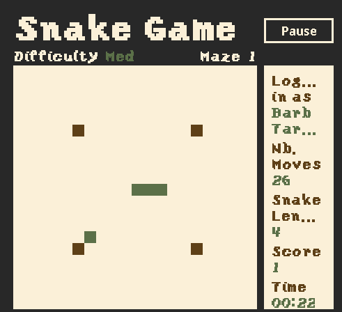

### The Snake Game, ya heard?

A simple snake game in java.
Using Threads and Java Swing to display the game.
As well as SQLite with a Login system to keep track of past games.

### How it looks:


### How to run the project:

#### Requirements:
* Java runtime installed

#### Adding music:
* Put your background music files in `src/main/resources/audio/`
* The current setup plays `jaunty_gumption.mp3`
* Music starts as soon as `main()` runs
* Menu screens and gameplay currently use the same track
* If a file is missing, the game still runs and prints a warning in the console

#### How to play the game:
* Just download the SnakeGame.jar file
* Run it
* Start playing with the arrows keys or `WASD`

Run with double pixel density:
```bash
java -Dsun.java2d.uiScale=2.0 -jar [.jar FILE]
```

### Developper Notes:

#### Using Maeven Test
- Run all tests:
```bash
mvn test
```
- Run only one test class:
```bash
mvn test -Dtest=UserDataTest
mvn test -Dtest=UserDBTest
mvn test -Dtest=UserDBIntegrationTest
```

- Run a single test method:
```bash
mvn test -Dtest="UserDBIntegrationTest#newUser_thenLogin_sameUserReturnedFromRealDB"
```

## Manual edit of the database
- install `litecli` following this [link](https://github.com/dbcli/litecli).
- Run it with `litecli` in terminal (Linux/Mac) or `WSL` (Windows)

Some commands:
```sql
-- Help
help

-- Open database
.open ./data/db/snake_game.db

-- List tables
.tables

-- Change a user to admin
UPDATE User SET isAdmin = TRUE WHERE username = "USERNAME"
-- also works using userId since both are unique
```
